# 跳跳棋活动系统架构设计

## 目录

1. [系统概述](#1-系统概述)
2. [架构设计](#2-架构设计)
3. [数据库设计](#3-数据库设计)
   - [3.1 核心实体关系](#31-核心实体关系)
   - [3.2 游戏模块实体](#32-游戏模块实体)
   - [3.3 奖励模块实体](#33-奖励模块实体)
   - [3.4 排行榜模块实体](#34-排行榜模块实体)
4. [核心业务流程](#4-核心业务流程)
   - [4.1 游戏机会获取流程](#41-游戏机会获取流程)
   - [4.2 游戏进行流程](#42-游戏进行流程)
   - [4.3 宝箱兑换流程](#43-宝箱兑换流程)
   - [4.4 排行榜更新流程](#44-排行榜更新流程)
5. [多活动支持与配置管理](#5-多活动支持与配置管理)
   - [5.1 多活动并存机制](#51-多活动并存机制)
   - [5.2 格子奖励配置机制](#52-格子奖励配置机制)
   - [5.3 奖励领取记录机制](#53-奖励领取记录机制)

## 1. 系统概述

跳跳棋活动系统是一个基于Java微服务架构开发的营销活动平台，旨在提升用户送礼消耗和平台活跃度。系统实现了一个互动性强的跳跳棋游戏，用户通过赠送特定礼物参与活动，获得游戏机会和丰富奖励。

系统主要包含三个核心功能模块：
- **跳跳棋游戏**：用户通过送礼获得跳跃机会，掷骰子决定前进步数，在不同格子获得奖励
- **宝箱兑换**：用户使用游戏中获得的积分兑换不同等级的宝箱奖励
- **排行榜系统**：展示活动期间获得积分最多的用户，前三名将获得额外奖励

## 2. 架构设计

跳跳棋活动系统采用微服务架构，主要包含以下几个部分：

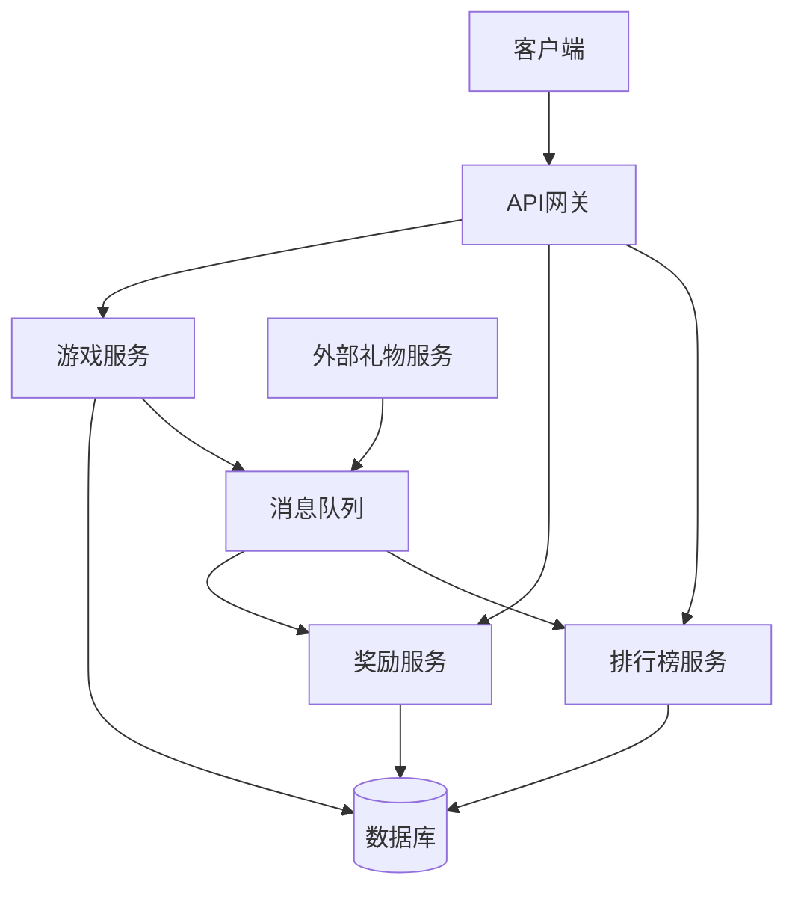

系统分为三个核心微服务：
- **游戏服务**：负责跳跳棋游戏核心逻辑，处理用户游戏机会获取、使用，管理游戏进度和状态
- **奖励服务**：管理宝箱兑换逻辑，处理积分累计和消费
- **排行榜服务**：维护用户积分排行榜，定期更新排行数据

## 3. 数据库设计

### 3.1 核心实体关系

系统核心实体关系如下：

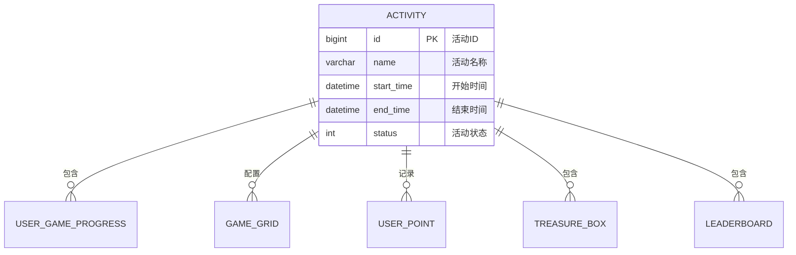

**关系说明**：
- 活动(ACTIVITY)是系统的核心实体，一个活动包含多个用户游戏进度、游戏格子配置、用户积分记录、宝箱配置和排行榜数据
- 活动具有明确的时间范围和状态，控制整个游戏流程

### 3.2 游戏模块实体

游戏模块的核心实体关系：

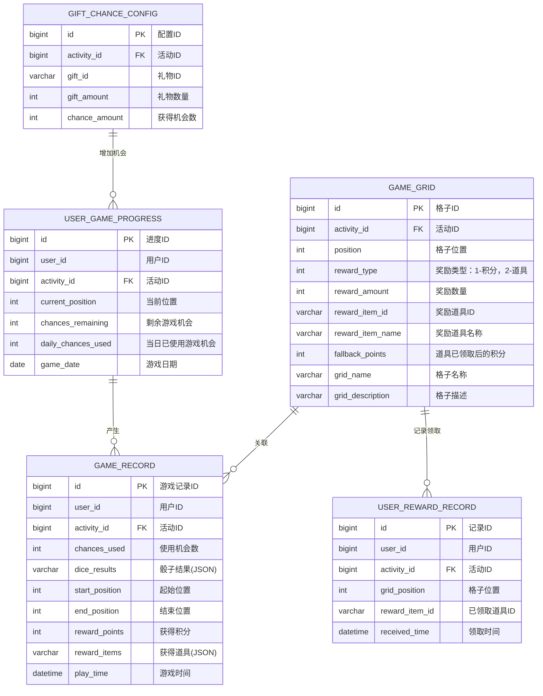

**关系说明**：
- 用户游戏进度(USER_GAME_PROGRESS)记录用户在游戏中的当前位置和剩余机会
- 游戏格子(GAME_GRID)定义了游戏路径上各个位置的奖励配置
  - 每个活动可以有自己独立的格子配置(通过activity_id关联)
  - reward_type区分奖励类型：1-积分，2-道具
  - 当reward_type=2时，reward_item_id和reward_item_name有效
  - fallback_points字段定义了道具已被领取后的替代积分奖励
- 游戏记录(GAME_RECORD)记录每次游戏的详细信息，包括骰子点数和移动结果
- 礼物机会配置(GIFT_CHANCE_CONFIG)定义了不同礼物可以获得的游戏机会数量
- 用户奖励记录(USER_REWARD_RECORD)记录用户已领取的道具奖励，用于判断一次性道具是否已被领取

### 3.3 奖励模块实体

奖励模块的核心实体关系：

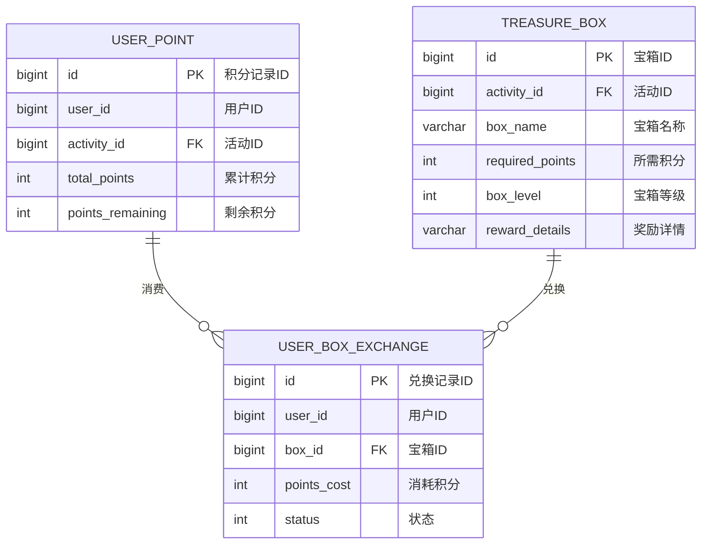

**关系说明**：
- 用户积分(USER_POINT)记录用户在活动中获得的积分总数和剩余可用积分
- 宝箱(TREASURE_BOX)定义了不同等级宝箱的积分需求和奖励内容
- 用户宝箱兑换(USER_BOX_EXCHANGE)记录用户兑换宝箱的历史和状态

### 3.4 排行榜模块实体

排行榜模块的核心实体关系：

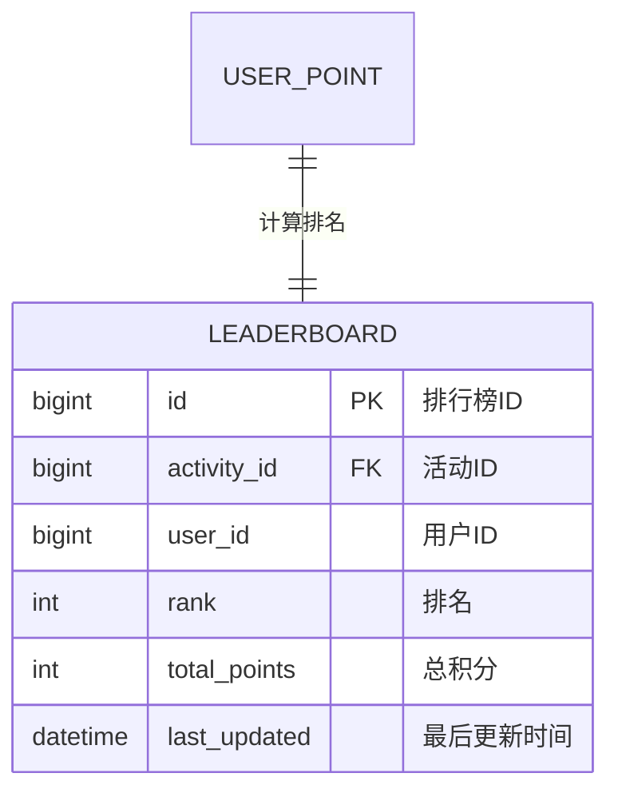

**关系说明**：
- 排行榜(LEADERBOARD)基于用户积分(USER_POINT)计算排名
- 排行榜定期更新，记录用户在活动中的积分排名情况

## 4. 核心业务流程

### 4.1 游戏机会获取流程

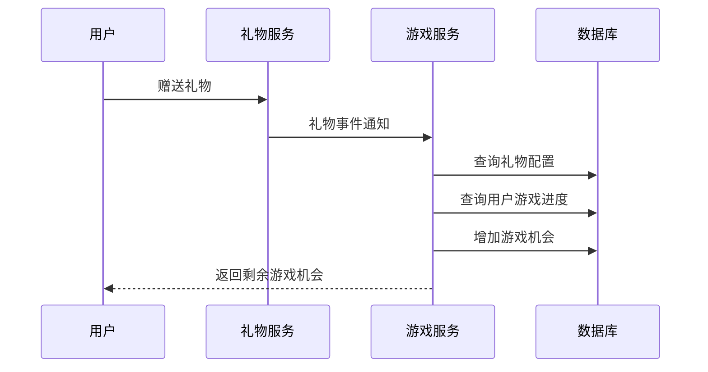

**数据库操作影响**：
- 读取 GIFT_CHANCE_CONFIG 表，确定礼物对应的游戏机会数量
- 读取 USER_GAME_PROGRESS 表，获取用户当前游戏进度
- 更新 USER_GAME_PROGRESS 表，增加用户的剩余游戏机会(chances_remaining)

### 4.2 游戏进行流程

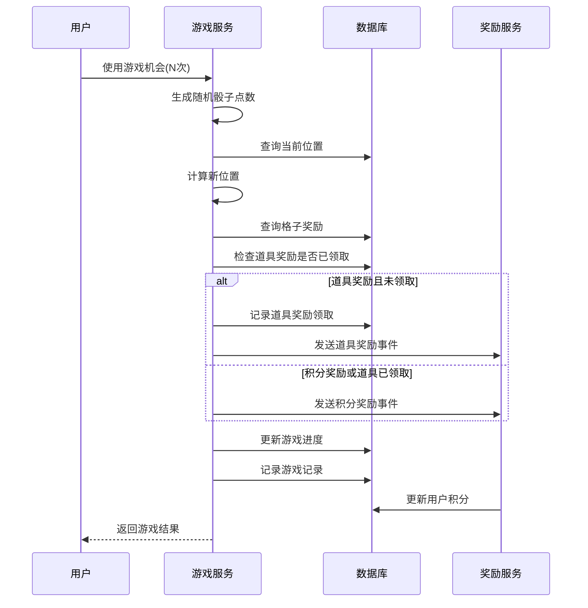

**数据库操作影响**：
1. 读取 USER_GAME_PROGRESS 表，获取用户当前位置和剩余机会
2. 读取 GAME_GRID 表，获取落点格子的奖励信息
3. 如果是道具奖励，读取 USER_REWARD_RECORD 表，检查用户是否已领取过该道具
   - 如果未领取，插入 USER_REWARD_RECORD 表，记录道具领取
   - 如果已领取，使用 GAME_GRID 表中的 fallback_points 作为替代积分奖励
4. 更新 USER_GAME_PROGRESS 表：
   - 减少剩余游戏机会(chances_remaining)
   - 增加已使用游戏机会(daily_chances_used)
   - 更新当前位置(current_position)
   - 更新游戏日期(game_date)
5. 插入 GAME_RECORD 表，记录本次游戏详情，包括骰子结果和获得的奖励
6. 更新 USER_POINT 表，增加用户积分

### 4.3 宝箱兑换流程

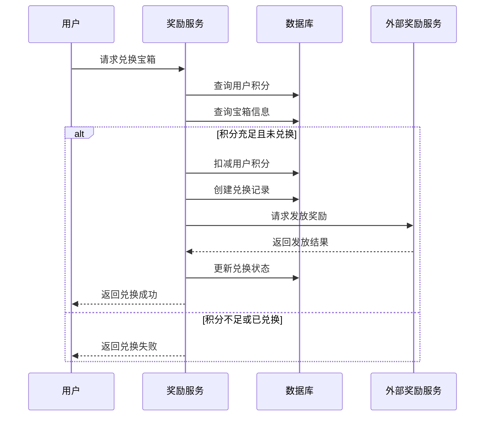

**数据库操作影响**：
1. 读取 USER_POINT 表，检查用户剩余积分
2. 读取 TREASURE_BOX 表，获取宝箱所需积分和奖励信息
3. 读取 USER_BOX_EXCHANGE 表，检查用户是否已兑换过该宝箱
4. 更新 USER_POINT 表，减少用户剩余积分(points_remaining)和增加已消费积分(points_consumed)
5. 插入 USER_BOX_EXCHANGE 表，记录兑换信息

### 4.4 排行榜更新流程

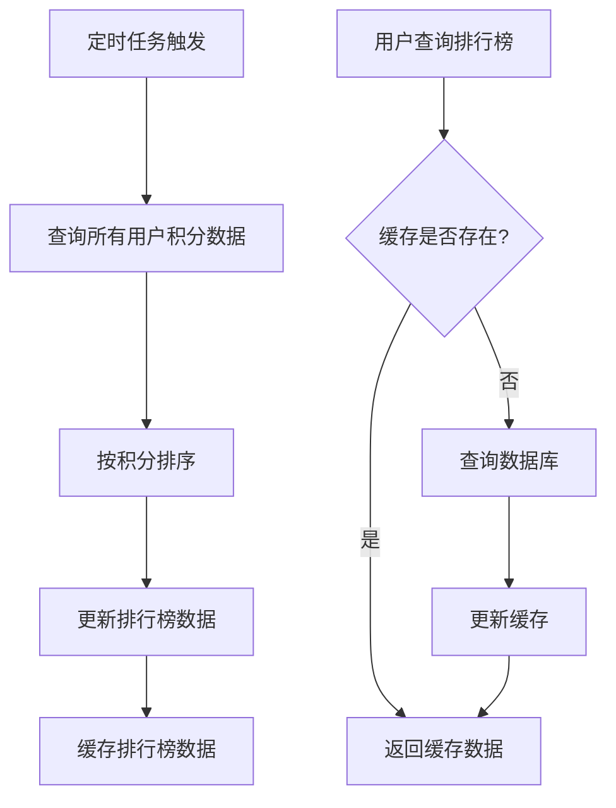

**数据库操作影响**：
1. 读取 USER_POINT 表，获取所有用户的积分数据
2. 更新 LEADERBOARD 表，设置用户排名和积分
3. 活动结束时，根据 LEADERBOARD 表的排名发放排行榜奖励

## 5. 多活动支持与配置管理

### 5.1 多活动并存机制

系统设计支持多个活动并存，主要通过以下机制实现：

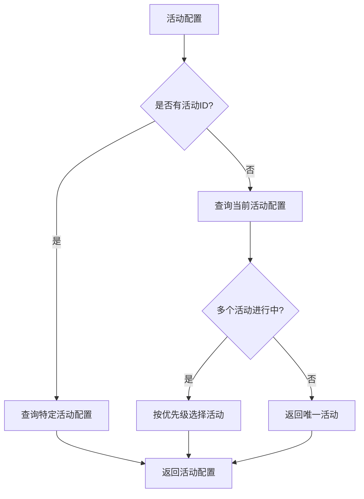

**多活动支持说明**：
1. 所有核心实体都通过 activity_id 关联到特定活动
2. 每个活动有独立的开始和结束时间，可以重叠或不重叠
3. 当多个活动同时进行时，系统可以通过优先级机制选择默认活动
4. 用户可以在多个活动间切换，每个活动有独立的游戏进度和积分

### 5.2 格子奖励配置机制

每个活动可以独立配置格子奖励，支持灵活的奖励策略：

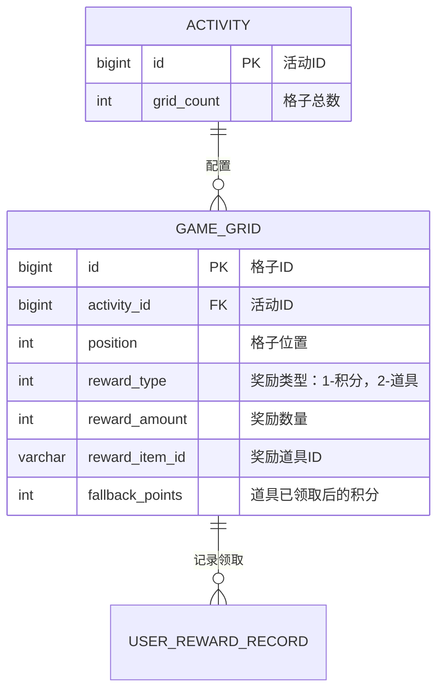

**格子奖励配置说明**：
1. 每个活动可以配置不同数量的格子(通过activity表的grid_count字段)
2. 格子奖励类型通过reward_type区分：
   - 1: 积分奖励 - 直接发放reward_amount数量的积分
   - 2: 道具奖励 - 发放reward_item_id指定的道具
3. 对于道具奖励，系统会检查用户是否已领取：
   - 如果未领取，发放道具并记录到USER_REWARD_RECORD表
   - 如果已领取，发放fallback_points数量的替代积分

### 5.3 奖励领取记录机制

系统通过USER_REWARD_RECORD表记录用户已领取的一次性奖励：

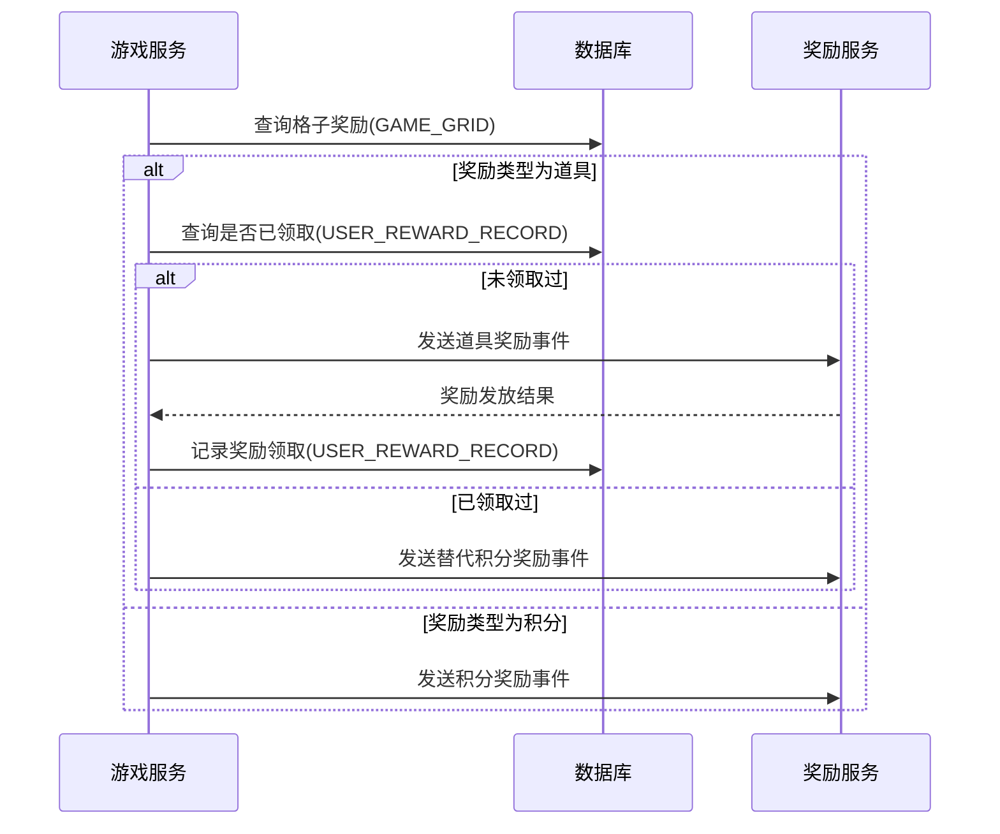

**奖励领取记录说明**：
1. USER_REWARD_RECORD表记录用户在特定活动中已领取的道具奖励
2. 记录包含user_id、activity_id、grid_position和reward_item_id，用于唯一标识已领取的奖励
3. 系统在发放奖励前会检查该记录，确保一次性道具不会重复发放
4. 当道具已领取时，系统会自动发放替代积分奖励
